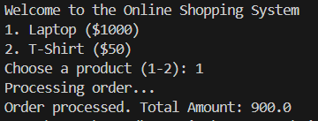

# Online Shopping System

## Overview
This is a simple console-based **Online Shopping System** implemented in Java. It demonstrates key Object-Oriented Programming (OOP) concepts such as:
- **Encapsulation**: Product details are private and accessed via methods.
- **Polymorphism**: Different discount strategies are applied dynamically.
- **Multithreading**: Orders are processed in a separate thread.
- **Exception Handling**: Prevents invalid inputs and ensures smooth execution.

## Features
- Add products to the cart.
- Apply discounts to calculate the final price.
- Multithreading ensures order processing runs independently.
- Exception handling to manage incorrect inputs.

## Technologies Used
- Java
- OOP Principles (Encapsulation, Polymorphism)
- Multithreading (Using `Thread` and `Runnable`)
- Exception Handling (`try-catch` blocks)

## Installation & Execution
1. Clone this repository:
   ```sh
   git clone https://github.com/22h51a6670/online-shopping-system.git
   cd online-shopping-system
   ```
2. Compile the Java program
    ```sh 
    javac shopping.java
    ```
3. Run the program:
    ```sh
    java shopping.java
    ```
## Outputs

## Usage
1. The system will prompt you to choose a product.
2. Select a product by entering its corresponding number.
3. The order will be processed in a separate thread.
4. The total price will be displayed after applying the discount    